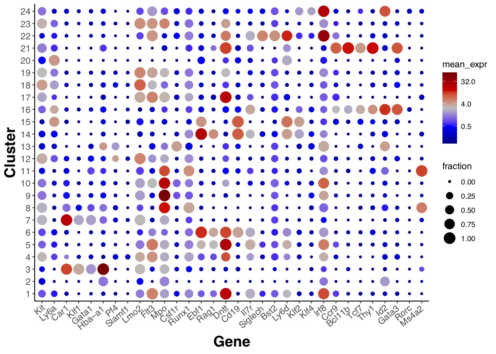
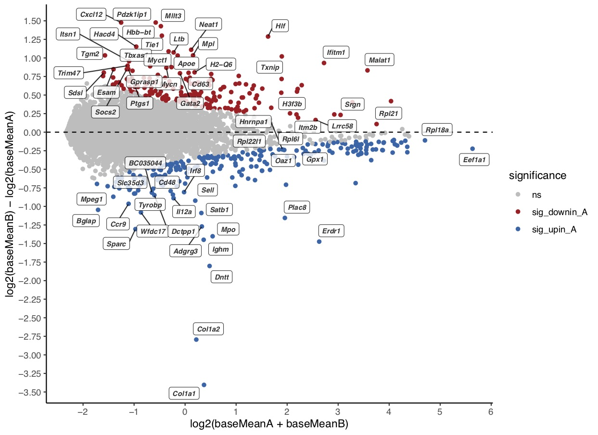

# utils

### Useful code and functions for the single cell analysis package 'RaceID'

- **Multi_plotexp.R:** Plot multiple gene expression umaps

- **fraction_dotplot:** Plot a dotplot of average gene expression per cluster for selected genes. 

- **MA_plot_function.R**:  Wrapper function for MAplot using ggplot.  
  
  
- **parallelized_clusterwise_comparisons.R**: Code to parallelize differential gene expression between 2 clusters for all pairwise cluster combinations.

- **Fisher_test.R**: Calculate enrichment of certain groups of cells in particular clusters.
